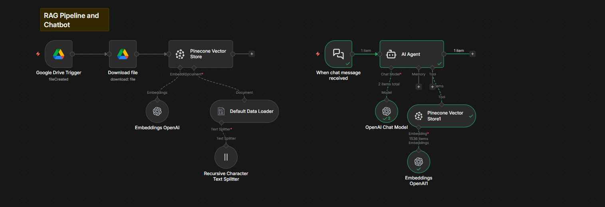

# N8N-Workflows

This repository contains three powerful **AI-driven automation workflows built using n8n**:

1. RAG Pipeline & Chatbot  
2. Customer Support Automation Workflow  
3. LinkedIn Content Creator Workflow  

These workflows demonstrate how to integrate **LLMs, vector databases, APIs, and automation tools** to solve real-world business problems.

---

# 📌 1. RAG Pipeline & Chatbot

## 🧠 Overview
This workflow implements a **Retrieval-Augmented Generation (RAG)** system that:
- Automatically ingests documents from Google Drive
- Converts them into embeddings
- Stores them in a vector database (Pinecone)
- Uses them to answer user queries via an AI chatbot

---

  

---

## ⚙️ Implementation

### 🔹 Step 1: Data Ingestion
- Google Drive Trigger detects new files
- Automatically downloads files

### 🔹 Step 2: Data Processing
- Default Data Loader extracts text
- Recursive Character Text Splitter splits into chunks

### 🔹 Step 3: Embedding Generation
- OpenAI Embeddings convert text into vectors

### 🔹 Step 4: Storage
- Pinecone Vector Store stores embeddings

### 🔹 Step 5: Chat System
- Trigger: When chat message received
- AI Agent:
  - Retrieves relevant chunks from Pinecone
  - Uses OpenAI Chat Model for contextual responses

---

## 💼 Business Use Cases

- 📄 Internal Knowledge Base Chatbot  
- 🧑‍💼 Employee Support Assistant (HR/IT queries)  
- 📚 Document Search for Legal/Finance Teams  
- 🏥 Medical Research Assistant  
- 🎓 AI Tutor using custom materials  

---

# 📌 2. Customer Support Workflow

## 🧠 Overview
Automates **email-based customer support** using AI:
- Classifies incoming emails
- Responds automatically to support queries
- Filters irrelevant emails

---

## ⚙️ Implementation

### 🔹 Step 1: Email Trigger
- Gmail Trigger detects incoming emails

### 🔹 Step 2: Classification
- Text Classifier categorizes emails:
  - Customer Support
  - Other

### 🔹 Step 3: Decision Flow
- Support queries → AI Agent  
- Others → No operation  

### 🔹 Step 4: AI Response
- AI Agent:
  - Uses OpenAI Chat Model
  - Retrieves context from Pinecone
  - Generates accurate responses

### 🔹 Step 5: Email Actions
- Add label (e.g., "AI-Handled")
- Send reply automatically

---

## 💼 Business Use Cases

- 📧 Automated Customer Support  
- 🛍️ E-commerce Query Handling  
- 🏦 Banking/FinTech Support Automation  
- 📞 Ticket Reduction Systems  
- ⚡ 24/7 Email Response Automation  

---

# 📌 3. LinkedIn Content Creator Workflow

## 🧠 Overview
Automates **LinkedIn content generation** using structured inputs:
- Reads topics from Google Sheets
- Fetches insights via API
- Generates high-quality posts using AI
- Stores output back in Sheets

---

## ⚙️ Implementation

### 🔹 Step 1: Trigger
- Manual trigger (Execute Workflow)

### 🔹 Step 2: Input Data
- Google Sheets:
  - Topic
  - Reference articles

### 🔹 Step 3: Research
- HTTP Request (Tavily API) fetches insights

### 🔹 Step 4: Content Generation
- AI Agent:
  - Uses OpenAI Chat Model
  - Combines input + research
  - Generates LinkedIn-ready content

### 🔹 Step 5: Output
- Updates generated content in Google Sheets

---

## 💼 Business Use Cases

- 📢 Personal Branding Automation  
- 🧑‍💻 Founder/CEO Content Creation  
- 📈 Marketing Team Scaling  
- 🏢 B2B Thought Leadership  
- 📊 Social Media Automation  

---

# 🧩 Tech Stack

- ⚙️ n8n – Workflow Automation  
- 🧠 OpenAI API – LLM & Embeddings  
- 🗂️ Pinecone – Vector Database  
- 📂 Google Drive API – File Handling  
- 📧 Gmail API – Email Automation  
- 📊 Google Sheets API – Data Storage  
- 🌐 Tavily API – Research  

---

# ⚡ Key Features

- 🔄 Fully automated workflows  
- 🧠 Context-aware AI responses (RAG)  
- 📬 Smart email classification & replies  
- ✍️ AI-generated LinkedIn content  
- 📊 Scalable modular architecture  

---

# 🚀 How to Use

1. Import workflows into n8n  
2. Configure credentials:
   - OpenAI API Key  
   - Pinecone API Key  
   - Google APIs (Drive, Gmail, Sheets)  
3. Set up triggers  
4. Execute workflows  

---

# 📈 Future Enhancements

- 🌍 Multi-language support  
- 💬 Slack / WhatsApp integrations  
- 📊 Analytics dashboard  
- 🔁 Feedback-based learning loop  

---

# 🤝 Contributing

Feel free to fork this repository, improve workflows, and submit pull requests.

---

# ⭐ Support

If you found this useful, give it a ⭐ on GitHub!
